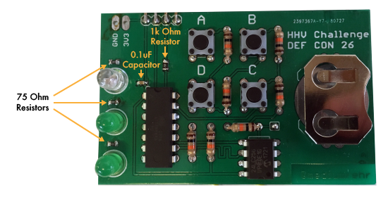

# DC26 HHV RE Challenge
DEF CON 26 Hardware Hacking Village Reverse Engineering Challenge

## Assembly

The schematic, layout, and BOM are all included in this folder. Before assembling, make sure you have correct parts, and the correct amount of each.

```
SMD parts:
3 75 Ohm 0603 resistors
1* 1k Ohm 0805 resistor
1 0.1uF 0603 capacitor

TH parts:
1 ATtiny84 IC
1 24LC256 IC
4 Tactile switches 6mm
7 10k Ohm resistors
2 Green LEDs 5mm
1 Red LED 5mm
1 CR2032 battery holder
1 CR2032 battery

Not included, but likely necessary:
a handful of male headers
a serial reader
some connection wire

* if you received parts at DEF CON, you likely received this as a pack of 2, but you'll only need one
```

Below is what the assembled challenge board should look like:



Most of the through hole components can only go once place. The ATtiny and 24LC256 are directional, so make sure they oriented correctly (notches should line up with silkscreened indicators). The LEDs should be in the order of red (or clear), green, green from the top down. Surface mount componets are noted in the image above. The three 75 Ohm resistors should be placed directly above each LED, capacitor should be placed to the top left of the ATtiny84, and the 1k Ohm resistor should be placed on the RX serial line (above the ATtiny84).
