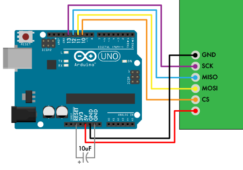
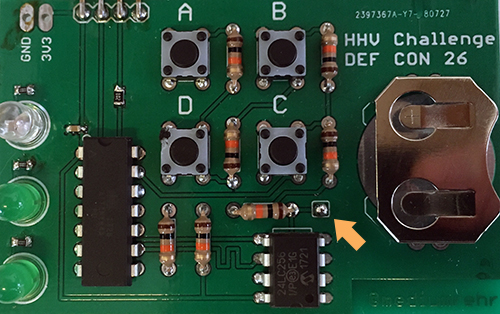
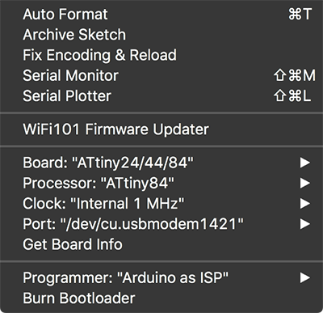

# DC26 HHV RE Challenge
DEF CON 26 Hardware Hacking Village Reverse Engineering Challenge

## Overview

This year's board features two challenge. The first part requires entering in the correct passcode using the four onboard buttons (labeled A, B, C, and D). Once the correct passcode has been entered, the middle, green LED will come on and the flag will be printed out via the serial interface. The second part of the challenge requires understanding how the second IC (the first being the ATtiny microcontroller) is used and manipulating that. The bottom, green LED will come on once that part is solved.

There are multiple ways to solve these challenges, and they are meant to be fun. If you're having trouble, or if you find a bug, reach out to [mediumrehr](https://www.twitter.com/mediumrehr)

Good luck!

## Instuctions

### Assembly
If your challenge isn't assembled, please see the hardware section for details on assembly. Most parts are explanitory as to where they go. For the surface mount parts, the 3-pack of resistors are for the LEDs, the 2-pack of resistors is for the RX line (only one of the resistors are necessary), and the single capacitor is used to reduce noise on the VCC input.

### Programming
There are two methods of loading the firmware onto the challenge board. Both require the same steps to start.

1. Connect the test points on the bottom of the challenge board to an arduino and add a capacitor between reset and GND on the Arduino UNO.

```
GND --> GND
SCK --> pin 13
MISO -> pin 12
MOSI -> pin 11
CS ---> pin 10
VCC --> 5V
```


Note 1: If using an Uno (or another arduino board with 5V IO pins), make sure VCC is connected to 5V when programming. If IO pins are 3.3V, connect VCC to 3.3V when programming.

2. Bridge the two pads to the bottom right of the buttons.



3. Install the [Arduino IDE](https://www.arduino.cc/en/Main/Software "Arduino IDE Download").

4. Configure the Arduino as an ISP and add support to the Arduino IDE for the Attiny84 by [following this guide](http://highlowtech.org/?p=1695 "Guide for adding ATtiny84 support in Arduino IDE").

Now, here's where things split. You can either use the Arduino IDE to compile and upload the firmware onto the board, or you can use avrdude to program the already compiled code onto the board. The former requires installing a couple Arduino IDE libraries.

**Using the Arduino IDE**

1. Install the [TinyWireM](https://github.com/adafruit/TinyWireM) library by cloning/downloading and unzipping the project into `Arduino/libraries`, likely in your Documents folder.

2. Connect the Arduino to the computer and under the `Tools` menu, set `Board` to `ATtiny24/44/84`, `Processor` to `ATtiny84`, `Clock` to `Internal 1 MHz`, `Port` should be whatever port the Arduino UNO is plugged into, and `Programmer` to `Arduino as ISP`.



3. Burn the bootloader (and set the clock speed) by going back to `Tools` and clicking `Burn Bootloader`

4. Once the bootloader is burned onto the Attiny84, open `DC26_HHV_RE_setup.ino` and click the right-pointing arrow in the top left corner to upload the sketch. This will configure the challenges board before loading the challenge. The red LED should come on once this step is finished (if the LED hasn't come on after a couple seconds, it's likely something went wrong).

5. Open and upload `DC26_HHV_RE_obfuscated.ino` (DC26_HHV_RE.ino does the same thing, it's just easier to read and might give away some of the fun of the game if you read the wrong line or two) to finish loading the challenge.

Ensure that the red LED appears briefly upon pressing one of the buttons. If it does, you're good to go! Disconnect the programming wires and Arduino power before putting a battery into the battery holder.

6. Remove the solder bridge on the two pads to the bottom right of the buttons.

**Using avrdude**

avrdude has the benefit of allowing you to flash the hex file, and therefor not needing to install another library, or possibly spoil the surprises of the challenge.

1. Make sure you you know the location of avrdude and its config file, your programmer id, and the path to the mounted usb device. The config file will come after `-C`, the programmer id after `-c`, and the programmer mount location after `-P`.

In Mac OS, the avrdude will likely be under `/Applications/Arduino.app/Contents/Java/hardware/tools/avr/bin/avrdude` and its config will likely be under `/Applications/Arduino.app/Contents/Java/hardware/tools/avr/etc/avrdude.conf`. If you're using Windows, avrdude will likely be under `C:\Program Files (x86)\Arduino\hardware\tools\avr\bin\avrdude` and its config will likely be under `C:\Program Files (x86)\Arduino\hardware\tools\avr\etc\avrdude.conf`.

If you're using an Arduino as ISP, the programmer id is likely `stk500v1`, if you're using a bus pirate, the id is likely `buspirate`. For more examples of programmer ids, see [Ladyada's Avrdude Tutorial](http://www.ladyada.net/learn/avr/avrdude.html).

To find the programmer's port, follow [this guide](https://www.mathworks.com/help/supportpkg/arduinoio/ug/find-arduino-port-on-windows-mac-and-linux.html), or something similar.

2. Burn the bootloader. This script will setup the attiny84 bootloader and configure it to use the 1MHz internal clock:
```
/path/to/avrdude -C /path/to/avrdude.conf -v -p attiny84 -c stk500v1 -P /path/to/usbport -b 19200 -e -U efuse:w:0xff:m -U hfuse:w:0xdf:m -U lfuse:w:0x62:m
```

3. Load and run the setup sketch:
```
/path/to/avrdude -C /path/to/avrdude.conf -v -V -p attiny84 -c stk500v1 -P /path/to/usbport -b 19200 -U flash:w:/path/to/DC26_HHV_RE_setup.1MHz.hex:i
```

This will configure the challenges board before loading the challenge. The red LED should come on once this step is finished (if the LED hasn't come on after a couple seconds, it's likely something went wrong).

4. Load and run the challenge sketch:
```
/path/to/avrdude -C /path/to/avrdude.conf -v -V -p attiny84 -c stk500v1 -P /path/to/usbport -b 19200 -U flash:w:/path/to/DC26_HHV_RE.1MHz.hex:i
```

Ensure that the red LED appears briefly upon pressing one of the buttons. If it does, you're good to go! Disconnect the programming wires and Arduino power before putting a battery into the battery holder.

6. Remove the solder bridge on the two pads to the bottom right of the buttons.